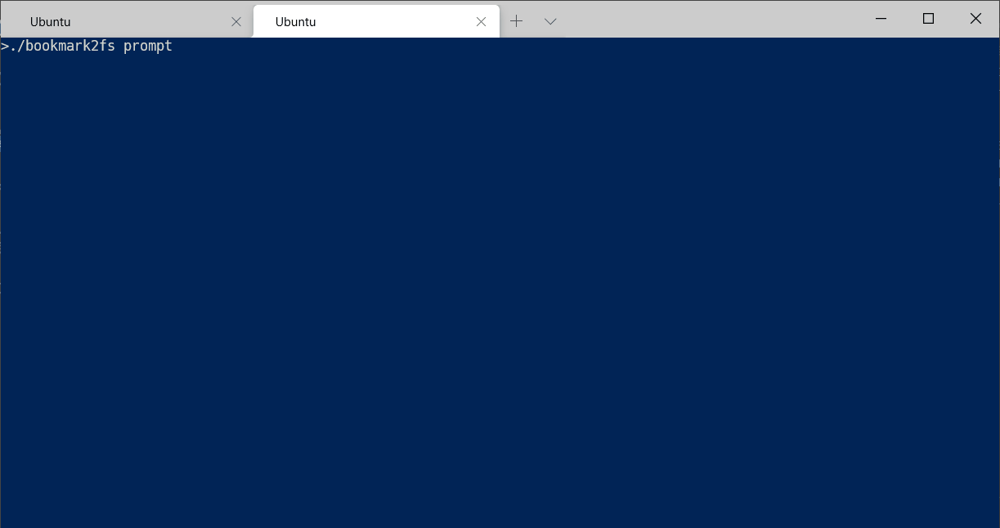

# bookmark2fs
A tool for converting JSON/html bookmarks to simple file trees and vice versa. Exports browser-compatible bookmark html.

## Usage
Conversion can be done either non-interactively using flags or interactively in a prompt as shown above.

Input bookmarks can be backed up into an SQLite database.

